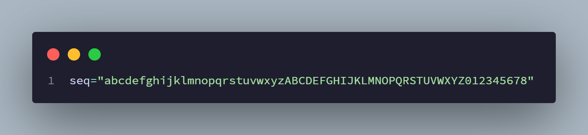
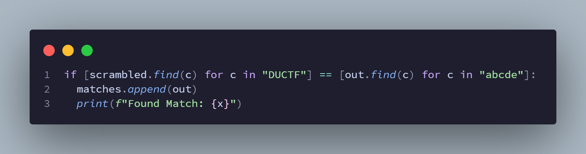
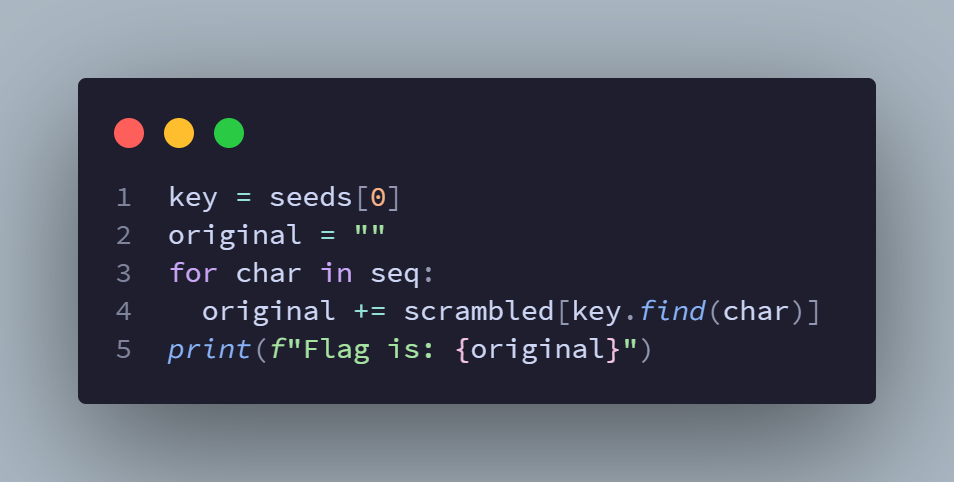

# Randomly Chosen

```yaml
# Challenge Info
category: crypto
difficulty: beginner
author: joseph

# Solution Info
solved_by: BraedynM
team: TAFE Coomera
points: 100
```

> Can you recover the flag from this random jumble of characters?

## 1 - What do we have here?

Two files, `randomly-chosen.py`, and `output.txt`.

The python script (see below) jumbles up the flag text, creating the output file. Neat.

Looks like the random seed is... randomly chosen. That'll come in handy.

Then, the flag is randomly sampled, to make a string **five times as long**.
Our output file is **305** characters, so that tells us that the original
flag must be **61** characters long.

> So, how do we reverse this?

I'm going to be honest, I was running on far too little sleep, and far too
much sugar, by this point, so my thought process is still a tad of a
mystery to even me, but...

First, we start with our best friend, the trusty brute force.

We know the random seed is something between 0 and 1337, so, why not try
everything and see what fits?

## 2 - Trying everything and seeing what fits

First, I created a basic sequence to test against. 61 unique characters,
consisting of the alphabet in lowercase, the alphabet in uppercase, and
some numbers to top it all off. Very creative, I know.



Once we had that, we could start making some (more) asumptions.

Since the flag format *usually* starts with `DUCTF`, I decided to compare
the positions of those uppercase letters in the flag, with the corresponding
lowercase letters in our sample string (i.e. `abcde`) to find which seeds
matched.

Note that we're looking for position matches, not character matches.
We do this, since we assume that the original input text *started with*
`DUCTF`.



> Have I lost you yet? No? Good.

After some tinkering, we've finally reduced our list of possible seeds
down to just the one.

Now, to reconstruct the flag.

## 3 - Reconstructing the flag

This is the easy part. All we need to do now is just find the positions of
our *own* scrambled set, then construct the flag from the characters in the
main output.

Make sense? Here's the code for that.



And with that, we're done! Here's the final result.

```txt
DUCTF{is_r4nd0mn3ss_d3t3rm1n1st1c?_cba67ea78f19bcaefd9068f1a}
```
